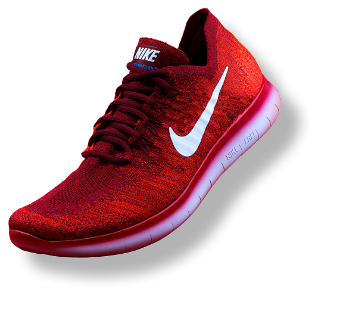

# 👟 Brand Page — Shoe Landing Page

A sleek, static **shoe brand landing page** built with **React + Vite** as a beginner learning project. This project demonstrates core React fundamentals through a clean, component-based UI design.

> 🔗 **Live Demo:** [View on Vercel](https://brand-page.vercel.app)  <!-- Update this URL after deployment -->

---

## 📸 Preview



---

## 🚀 Tech Stack

| Technology | Purpose |
|---|---|
| **React 19** | UI library (component-based architecture) |
| **Vite 8** | Lightning-fast dev server & build tool |
| **Vanilla CSS** | Custom styling with CSS variables |
| **Google Fonts** | Poppins font family |

---

## 📁 Project Structure

```
Brand_Page/
├── public/
│   ├── favicon.svg
│   ├── icons.svg
│   └── images/
│       ├── amazon.png          # Amazon marketplace logo
│       ├── brand_logo.png      # Brand navbar logo
│       ├── flipkart.png        # Flipkart marketplace logo
│       └── shoe_image.png      # Hero section shoe image
├── src/
│   ├── assets/
│   │   ├── hero.png
│   │   ├── react.svg
│   │   └── vite.svg
│   ├── components/
│   │   ├── Navigation.jsx      # Navbar with logo, links & login button
│   │   └── Hero.jsx            # Hero section with CTA & brand icons
│   ├── App.jsx                 # Root component composing Nav + Hero
│   ├── App.css                 # All styles (global reset, nav, hero, buttons)
│   ├── index.css               # Global CSS entry (currently empty)
│   └── main.jsx                # React DOM entry point with StrictMode
├── index.html                  # HTML template
├── vite.config.js              # Vite configuration
├── package.json                # Dependencies & scripts
└── .gitignore                  # Git ignore rules
```

---

## 🧠 React Concepts Practiced

This project was built to practice the following **React fundamentals**:

- ✅ **Functional Components** — `Navigation` and `HeroSection` are arrow-function components
- ✅ **Component Composition** — `App` composes child components (`<Navigation/>`, `<HeroSection/>`)
- ✅ **JSX Syntax** — Writing HTML-like syntax inside JavaScript
- ✅ **`className` attribute** — Using `className` instead of `class` for CSS in JSX
- ✅ **Import/Export** — ES module `export default` and `import` to organize components
- ✅ **Project Structure** — Organizing code into `components/`, `assets/`, `public/`
- ✅ **Vite + React Setup** — Scaffolding a modern React app with Vite
- ✅ **StrictMode** — Wrapping `<App/>` in `<StrictMode>` for development checks
- ✅ **CSS Variables** — Using `:root` custom properties (`--red`, `--gray`)
- ✅ **Static Assets** — Serving images from the `public/` folder

---

## 🛠️ Getting Started

### Prerequisites

- **Node.js** ≥ 18
- **npm** ≥ 9

### Installation

```bash
# Clone the repository
git clone https://github.com/<your-username>/Brand_Page.git

# Navigate into the project
cd Brand_Page

# Install dependencies
npm install

# Start development server
npm run dev
```

The app will be running at `http://localhost:5173`

### Available Scripts

| Script | Command | Description |
|---|---|---|
| Dev | `npm run dev` | Start Vite dev server with HMR |
| Build | `npm run build` | Create production build in `dist/` |
| Preview | `npm run preview` | Preview production build locally |
| Lint | `npm run lint` | Run OxLint for code quality checks |

---

## 🌐 Deployment (Vercel)

This project is deployed on **Vercel**. To deploy your own:

1. Push your code to a **GitHub repository**
2. Go to [vercel.com](https://vercel.com) and sign in with GitHub
3. Click **"Add New Project"** → Import your repo
4. Vercel auto-detects Vite — just click **Deploy**
5. ✅ Your site is live!

> **Framework Preset:** Vite  
> **Build Command:** `npm run build`  
> **Output Directory:** `dist`

---

## 📄 License

This project is open source and available under the [MIT License](LICENSE).

---

## 🙌 Acknowledgements

- Built as **Project 1** in my React learning journey
- Design inspired by modern shoe brand landing pages
- Icons & images used for educational purposes only

---

<p align="center">
  Made with ❤️ while learning React
</p>
